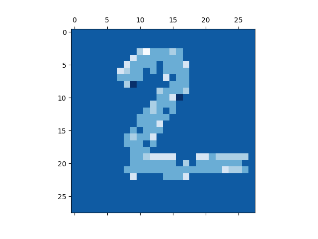

Hi everyone, 
This is a small side project to learn more about the new trend in deep learning named “Attention”. 
I started this project with reading the famous transformer paper, “All you need is attention”. When studying this paper, I didn’t really grasp the concept, so I looked for additional resources. 
One which was very helpful for me was the DeepMind presentation of Alex Graves and I would certainly recommend this resource. 

To my knowledge attention can be defined as a mechanism to explicitly encode where the network should pay attention to. 
This could be done with different types of input, such as; text where the network needs to pay attention to some words more than others,  time series data where the network needs to pay attention to some timesteps more than others or, as we will discuss in this project, an image where the network needs to pay attention to some pixels more than others.

Intuitively, when you are paying attention to something you weigh all the inputs and decide where to focus on. 
Think about reading a book when you want to answer a certain question, some words don’t add value to what you are looking for, so you weigh them less, while other have more impact, so you weigh them more.
In the weigh process you are not only looking at the inputs separately, but also the interaction between them, this gives meaning. 
So we are looking for a way to let the inputs interact with each other. 
Let’s make this more concrete: let’s say we have 3 inputs named X: x1,x2,x3 and we would like to see the interaction between those inputs. 
We can look at the pairwise interaction of the inputs by using the cartesian product of X: (x1,x1),(x1,x2),(x1,x3), (x2,x1),(x2,x2),(x2,x3), (x3,x1),(x3,x2),(x3,x3). 

In standard feed forward networks, FFN, the notion of attention is implicitly encoded. 
In neural networks we have layers with weights which weigh the input of the previous layer. 
When we zoom in at one layer we can see that it weighs every input separately, but does not encode specific pairwise interaction between the inputs. 
In a FFN we would get the calculation for a neuron like: w1*x1 + w2*x2 + w3*x3. So this is a linear interaction of the weights. 
Often this is not a rich enough representation, therefor it goes through a non-linearity interaction. 
To form even more interaction the result of one layer is passed into another layer as input. 

However why don’t we make the notion of attention explicit? This is what a so called “attention-layer” brings to the table. 
The attention mechanism uses pairwise interaction between the inputs to see at what the network should focus on. 

In the attention layer we create 3 representations of the same input.
We will do this with 3 different weight matrices. We call this matrices QW for query weights, KW for key weights and VW for value weights. 
When we have an input, X,  we will do the following calculations Q = X*QW, K = X*KW, V = X*VW. So far this has nothing to do with attention.
At this point we have three representations of X. 
Now we are ready for the attention magic which is Q*K_T and yes that’s the magic… A simple dot product, is all which there is to create the pairwise interaction between the input representations, Q and K. 
After this you will have a matrix with the pairwise connections. But what does Q and K represent when the network is fully trained? Are these just random representations? 
Intuitively you can say that Q represent where to put attention to, while K represent more of the properties of the input. 
The last step is to multiply this attention with the representation of the input called V. 
This is done in order to let Q and K focus on the attention weights and to keep V close to the original representation of X. 

In the code I used a attention layer in combination with a FNN to learn to classify the MNIST dataset. 

First I transform the input of 28x28 to 748. Then I use a attention layer to see which pixels should attend to each other. 

I also plotted the attention matrix(QK_T) to see where the network was paying attention to. 
I calculated this using averages of the attention values by summing over the rows and dividing by length of the rows and averages of the attention values by summing over the columns and dividing by length of the columns. 

Column attention shows which pixels are paid attention to. Result:

Row attention shows which pixels are paying attention to other pixels. Result:

Future directions: I am still wondering why attention only uses pairwise connections instead of something such as groups such as ((1,2) and 3).

   

